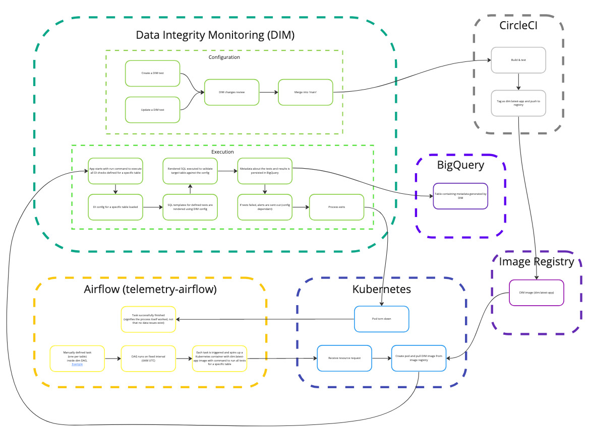
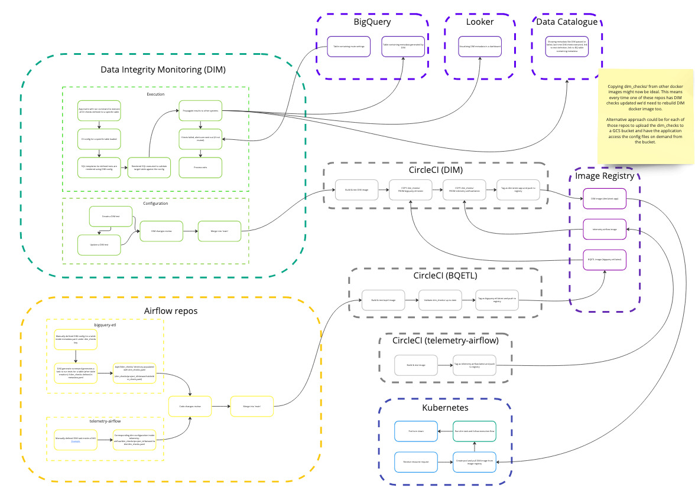

[](https://dl.circleci.com/status-badge/redirect/gh/mozilla/dim/tree/main)

# Data Integrity Monitoring (dim)

`dim` is a simple application that can be used to define specific rules which data in your tables should follow. Such as number of rows in a specific date partition. It also provides the functionality to execute those checks and persists its metadata in a table in BigQuery.

> BigQuery is the only supported data source.

## Prerequisites

- python >= `3.10` < `3.11`
- docker
- BigQuery

## Project structure

```
.
├── Dockerfile
├── Makefile
├── README.md
├── pyproject.toml
├── dim
│   ├── app.py
│   ├── bigquery_client.py
│   ├── cli.py
│   ├── const.py
│   ├── error.py
│   ├── models
│   │   ├── dim_config.py
│   │   └── dim_check_type - contains dim test type object definitions
│   │       └── templates - contains SQL templates used by corredponding dim tests
│   ├── slack.py
│   └── utils.py
├── dim_checks - contains dim configs that specify tests and their conditions for tables
│   ├── [project]
│   │   └── [dataset]
│   │       └── [table]
│   │           └── dim_checks.yaml
│   └── [project]
│       └── [table]
│           └── [table]
│               └── dim_checks.yaml
├── docs
│   └── static - contains static files used by docs in the repo
├── requirements - contains requirement files
└── tests
    ├── cli - cli module tests
    │   └── test_configs - contains .yaml configs used for testing
    └── dim_checks - contains tests for dim test types
```

## Getting Started (Docker)

1. Inside `dim_checks/` create a folder structure corresponding to `[project_id]/[dataset]/[table]` with `dim_checks.yaml` file inside.
1. Add dim check definitions you'd like to run against your table (see TODO: [section_name](link) for more info).
1. Build docker app image using `make build`
1. Run the checks against your table using `docker run dim:latest run --project_id=[project_id] --dataset=[dataset] --table=[table] --date=[date_partition]`[^1].

## Getting Started (local)

1. Inside `dim_checks/` create a folder structure corresponding to `[project_id]/[dataset]/[table]` with `dim_checks.yaml` file inside.
1. Run `make setup-venv` (created virtual environment called `venv` in the project directory)
1. Run `make upgrade-pip` (upgrades pip inside `venv` virtual environment)
1. Run `make update-deps` (compiles requirements for the application and development)
1. Run `make update-local-env` (installs requirements for the application and development)
1. Run `make venv/bin/python -m pip install .` (installs dim package in your local virtual environment)

_Additional info_

[^1]:
  Your container should have the following two environment variables set:   `GOOGLE_APPLICATION_CREDENTIALS` and `SLACK_BOT_TOKEN`. It's up to you have you want to do this. One option is to set these in your docker command as follows: `docker run -v [local_path_to_gcp_creds_file]:/sa.json -e GOOGLE_APPLICATION_CREDENTIALS=/sa.json -e SLACK_BOT_TOKEN="[SLACK_TOKEN]" dim:latest run --project_id=[project_id] --dataset=[dataset] --table=[table] --date=[date_partition]`

## Functionality

This is a very early stage application and has very limited functionality. Currently, the following commands are available:

- `run` - runs all tests defined in the `dim` yaml for the specified table for a specific date partition.

- `backfill` - runs all tests for defined in the `dim` yaml for the specified table for a specific range of date partitions (each processed individually).

- `validate` - used to validate a specific `dim` yaml config.

- `mute` - Adds a record to the `muted_alerts` table containing information about which alerts for specific tables and date partitions should not be sent out.

- `unmute` - Removes a record from the `muted_alerts` table for the specified table and date partitions.

## Running (unit) tests

1. Build docker test image using `make build-test`
1. Run `make test-all`. This runs the following commands: `make test-unit` && `make test-flake8` &&  `make test-isort` && `make test-black` (these can also be run individually).

## Architecture design

### Diagram (current)



### Diagram (future idea)



### App execution flow

1. Run docker image with run command.
1. Check corresponding path exists (`dim_checks/[gcp_project]/[dataset]/[table]`).
1. Validate matching configs on read time (this should be fine since they're very small).
1. Create corresponding test objects, this includes test execution and success parameters.
1. Execute all tests and persist results in BQ (can be used to build Looker dashboard on top of this dim exeuction metadata).
1. If alerting enabled, alert sent out if any of the tests failed.

# Other TODOs

## Add pre-commit checks

- *.md file linter
- *.py files (flake8 + black)
- *.yaml linter
